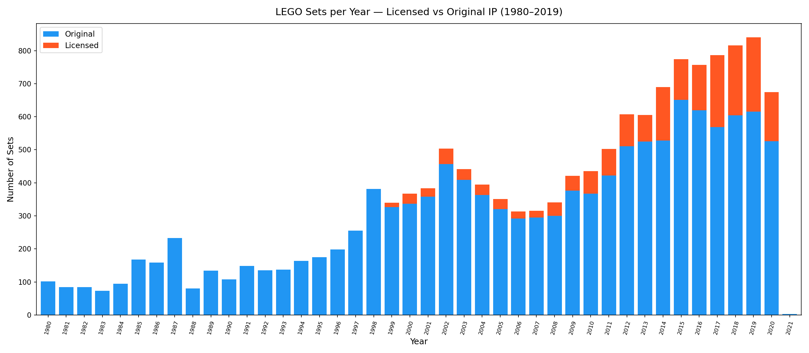
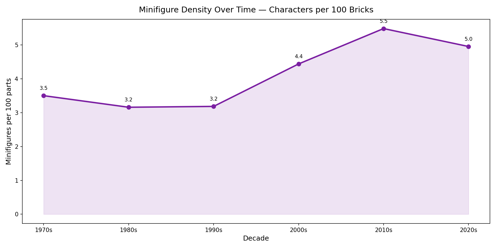
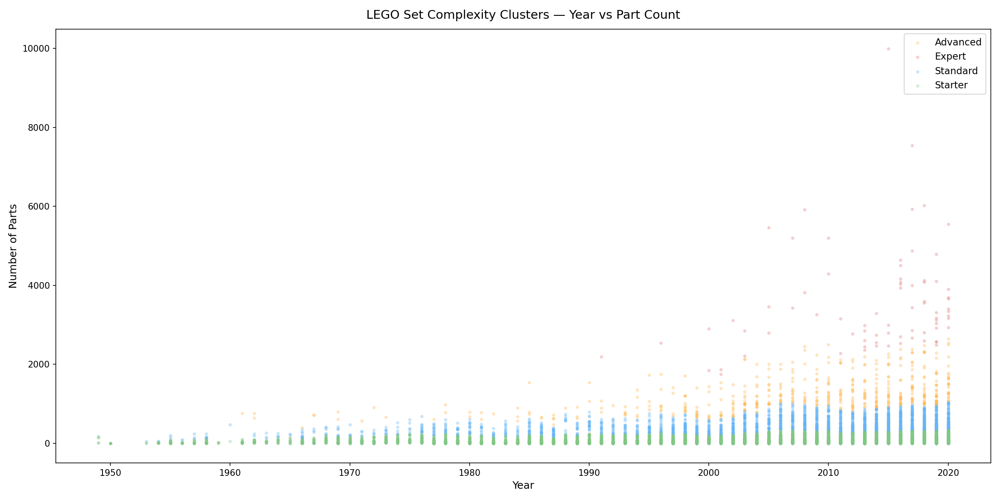
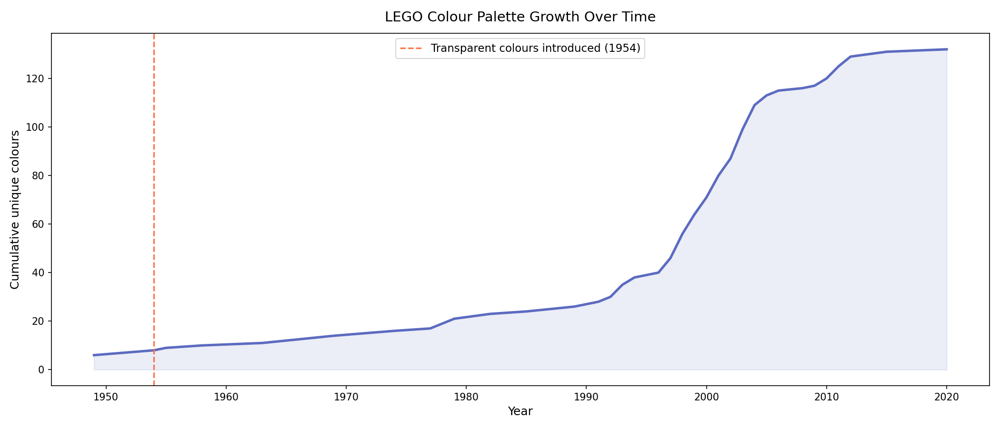
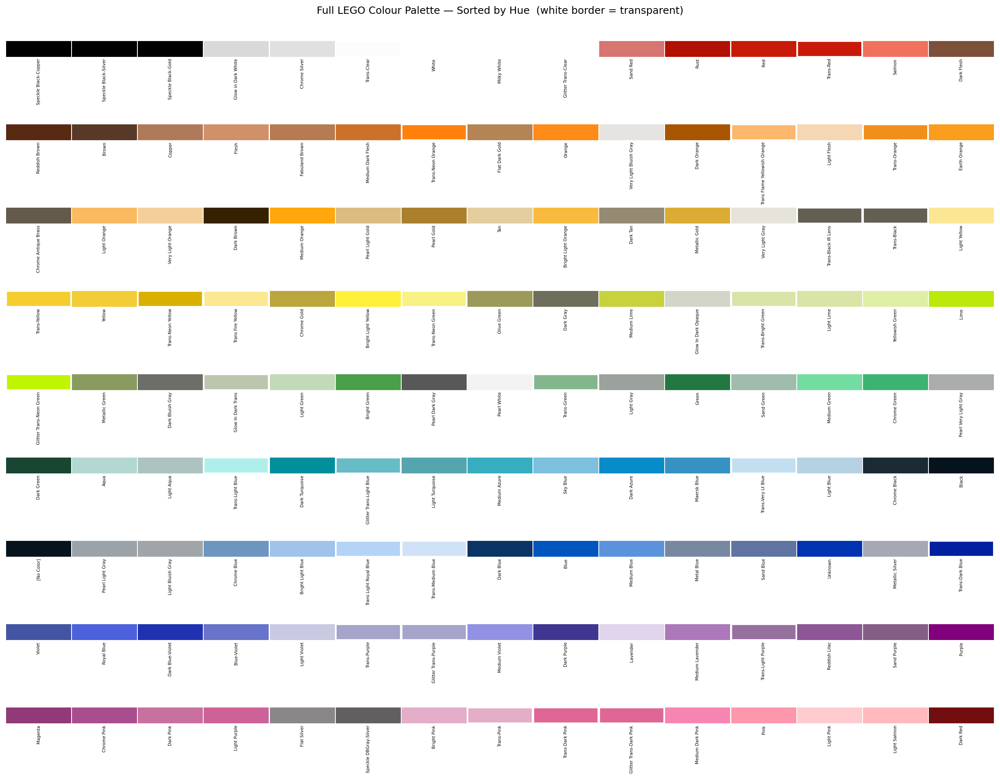
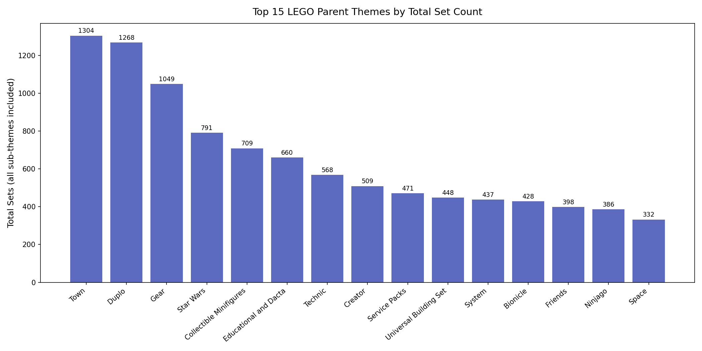

# LEGO Dataset Analysis

Licensed IP grew from zero to 27.6% of LEGO's annual releases between 1999 and 2017. Average parts per set grew 8× over seven decades. Minifigure density rose 57% between the 1970s and 2010s. This project traces those shifts across six analytical dimensions using four relational datasets covering every LEGO product ever produced — 15,710 sets, 596 themes, 135 colours, and 25,000 minifigure inventory records from Rebrickable.

The central question: did licensed IP transform what LEGO makes, or just how much of it? The data shows both — franchise deals drove volume and colour palette expansion, but the deeper change was structural. Sets became character-delivery vehicles. Minifigure density and licensed share track the same curve from 2000 onward.

---

## Quick Start

```bash
git clone https://github.com/xavier-oc-programming/lego-dataset-analysis.git
cd lego-dataset-analysis
pip install -r requirements.txt
jupyter notebook notebooks/analysis/lego_analysis.ipynb
```

`data/inventory_parts.csv.gz` decompresses automatically on first run — no manual setup required.

---

## Key Findings

**Licensed IP grew to 27.6% of annual releases — significant but never the majority.** Star Wars is the single largest licensed franchise with 776 sets. Licensed share went from 0% before 1999 to 8.2% by 2000, 15.6% by 2010, and 22.0% by 2020, peaking at 27.6% in 2017.



---

**Sets became more character-focused as licensed IP scaled.** Minifigure density grew from 3.5 figures per 100 parts in the 1970s to 5.5 in the 2010s — a 57% increase. Licensed sets average 2.86 unique character types per set versus 2.37 for original IP. Pirates of the Caribbean leads at 4.7 unique fig types per set; Harry Potter and Indiana Jones average 4.2. The density trend and licensed share trend move in lockstep from 2000 onward.



---

**Set complexity grew 8× over seven decades.** Average parts per set rose from 32 in the 1950s to 259 in the 2020s. K-Means clustering identifies four tiers: Starter, Standard, Advanced, and Expert. Technic and architectural collector sets dominate the Expert cluster; City and seasonal sets anchor the Starter band.



---

**The colour palette tripled in the 2000s alone.** 53 of 132 production colours were introduced in the 2000s — more than the preceding five decades combined. Transparent colours first appeared in 1954. The palette expansion tracks the licensed IP timeline: franchise deals required new metallics, flesh tones, and special-effect colours the original palette lacked.





---

**LEGO's theme hierarchy is broad, not deep.** Maximum hierarchy depth is 2 levels. Town leads by cumulative set count (1,304 sets), followed by Duplo (1,268). Star Wars ranks fourth with 791 sets despite spanning only 22 years. Technic leads on sub-theme count.



---

**The 2000s were the inflection decade across every metric.** Set count doubled, licensed share jumped from 0.7% to 8.5%, 53 new colours entered the palette, and minifigure density climbed from 3.2 to 4.4 per 100 parts — all within the same decade.

| Decade | Total Sets | Unique Themes | Avg Parts | % Licensed |
|--------|-----------|---------------|-----------|------------|
| 1950s | 135 | 6 | 32 | 0% |
| 1970s | 620 | 62 | 108 | 0% |
| 1990s | 2,041 | 170 | 125 | 0.7% |
| 2000s | 3,831 | 279 | 166 | 8.5% |
| 2010s | 6,813 | 254 | 196 | 20.6% |
| 2020s | 677 | 82 | 259 | 21.9% |

---

## Analysis Flow

```
pipeline
    │
    │  ── [Ingestion] ────────────────────────────────────────────────────
    ├── pd.read_csv()  →  colors.csv             →  colors      (135 colours)
    ├── pd.read_csv()  →  sets.csv               →  sets        (15,710 sets)
    ├── pd.read_csv()  →  themes.csv             →  themes      (596 themes)
    ├── pd.read_csv()  →  inventories.csv        →  inventories
    ├── pd.read_csv()  →  inventory_minifigs.csv →  inv_minifigs
    ├── gunzip + read  →  inventory_parts.csv.gz →  inv_parts
    │
    │  ── [Baseline exploration] ─────────────────────────────────────────
    ├── colors.nunique / groupby('is_trans')           →  colour counts
    ├── sets.sort_values('year').head()                →  debut year
    ├── sets.sort_values('num_parts').tail()           →  top 5 largest sets
    ├── sets.groupby('year').count()                   →  sets_by_year
    ├── sets.groupby('year').agg(nunique)              →  themes_by_year
    ├── twinx dual-axis line chart                     →  sets & themes over time
    ├── groupby('year').agg(mean)                      →  avg_parts scatter
    ├── value_counts + pd.merge(themes)                →  top themes bar chart
    │
    │  ── [Analysis 1 — Licensed IP] ─────────────────────────────────────
    ├── keyword match on theme names                   →  ip_type column
    ├── merge(sets, themes[ip_type])                   →  sets_ip
    ├── groupby(['year','ip_type']).size().unstack()   →  stacked bar chart
    └── top-5 licensed themes, annual % licensed
    │
    │  ── [Analysis 2 — Complexity Clustering] ───────────────────────────
    ├── num_parts / annual_mean                        →  relative_complexity
    ├── StandardScaler + KMeans(k=4)                   →  Starter/Standard/Advanced/Expert
    ├── scatter(year, num_parts, colour=cluster)
    └── cluster distribution bar chart per top-10 theme
    │
    │  ── [Analysis 3 — Colour Evolution] ────────────────────────────────
    ├── inv_parts → inventories → sets                 →  color_year
    ├── groupby('color_id').year.min()                 →  first_appearance
    ├── cumsum of new colours by year                  →  palette growth chart
    └── new colours per decade bar chart + swatch grid
    │
    │  ── [Analysis 4 — Theme Hierarchy] ─────────────────────────────────
    ├── recursive resolve_root(theme_id)               →  root_id + depth
    ├── sets.merge(root_id) → groupby → count          →  root set totals
    └── top 15 parent themes bar chart
    │
    │  ── [Analysis 5 — Decade Summary] ──────────────────────────────────
    ├── sets['decade'] = (year // 10) * 10
    ├── groupby(decade): total sets, themes, avg parts, % licensed
    └── pandas Styler with Blues gradient
    │
    │  ── [Analysis 6 — Minifigure Density] ──────────────────────────────
    ├── inv_minifigs → inventories → sets_ip           →  fig_sets
    ├── unique fig types + total figs per set
    ├── figs_per_100_parts = total_figs / num_parts × 100
    ├── groupby(decade) mean density                   →  trend line chart
    ├── licensed vs original unique fig types          →  bar comparison
    └── top licensed themes by avg unique fig types
```

---

## Dataset Schema

### colors.csv
| Column | Type | Description |
|--------|------|-------------|
| id | int | Unique colour ID |
| name | str | Colour name |
| rgb | str | Hex RGB value (no `#` prefix) |
| is_trans | str | `t` = transparent, `f` = opaque |

### sets.csv
| Column | Type | Description |
|--------|------|-------------|
| set_num | str | Unique set identifier |
| name | str | Set name |
| year | int | Release year |
| theme_id | int | Foreign key → themes.id |
| num_parts | int | Part count |

**Computed columns**

| Column | Derived from | Description |
|--------|-------------|-------------|
| ip_type | theme name keyword match | `Licensed` or `Original` |
| relative_complexity | num_parts / annual mean | Era-relative part count |
| complexity | KMeans cluster label | Starter / Standard / Advanced / Expert |
| root_id | recursive parent_id walk | Top-level parent theme ID |
| decade | year // 10 * 10 | Decade bin |
| figs_per_100_parts | total_figs / num_parts × 100 | Minifigure density |

### themes.csv
| Column | Type | Description |
|--------|------|-------------|
| id | int | Unique theme ID |
| name | str | Theme name |
| parent_id | float | Parent theme ID; NaN if top-level |

### inventories.csv
| Column | Type | Description |
|--------|------|-------------|
| id | int | Inventory ID |
| set_num | str | Foreign key → sets.set_num |

### inventory_minifigs.csv
| Column | Type | Description |
|--------|------|-------------|
| inventory_id | int | Foreign key → inventories.id |
| fig_num | str | Minifigure identifier |
| quantity | int | Count in this inventory |

### inventory_parts.csv.gz
| Column | Type | Description |
|--------|------|-------------|
| inventory_id | int | Foreign key → inventories.id |
| color_id | int | Foreign key → colors.id |
| quantity | int | Count in this inventory |
| is_spare | bool | Whether this is a spare part |

---

## Architecture

```
lego-dataset-analysis/
│
├── notebooks/
│   ├── analysis/
│   │   └── lego_analysis.ipynb        # main analysis — baseline + 6 improvements
│   └── concepts/                      # annotated concept notebooks
│       └── [11 notebooks]
│
├── data/
│   ├── colors.csv                     # 135 LEGO colours with RGB and transparency
│   ├── sets.csv                       # 15,710 sets with year, theme, part count
│   ├── themes.csv                     # 596 themes in parent/child hierarchy
│   ├── inventories.csv                # set → inventory mapping
│   ├── inventory_minifigs.csv         # minifigures per inventory
│   └── inventory_parts.csv.gz         # colour usage per inventory (decompressed at runtime)
│
├── plots/
│   ├── licensed_vs_original.png
│   ├── complexity_clusters_scatter.png
│   ├── complexity_clusters_by_theme.png
│   ├── colour_palette_growth.png
│   ├── colour_palette_swatches.png
│   ├── colour_introductions_by_decade.png
│   ├── theme_hierarchy_top15.png
│   ├── minifig_density_by_decade.png
│   ├── minifig_density_scatter.png
│   └── minifig_licensed_vs_original.png
│
├── assets/
├── docs/
│   └── COURSE_NOTES.md
├── requirements.txt
├── .gitignore
└── README.md
```

---

## Dependencies

| Package | Purpose |
|---------|---------|
| pandas | DataFrame loading, groupby, merge, aggregation, Styler |
| matplotlib | Line charts, scatter plots, bar charts, swatch grids |
| numpy | Numerical operations, NaN handling |
| scikit-learn | KMeans clustering, StandardScaler |
| notebook | Jupyter notebook runtime |

---

## Background

This project was built as part of 100 Days of Code — The Complete Python Pro Bootcamp, Day 74: Aggregate and Merge Data with Pandas. See [docs/COURSE_NOTES.md](docs/COURSE_NOTES.md) for the original exercise brief and concept notes.
